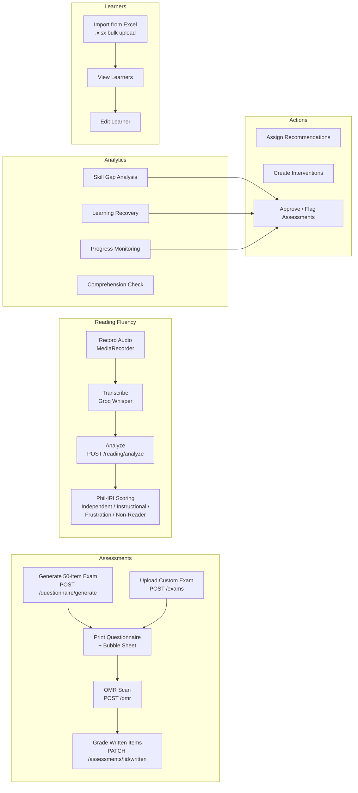
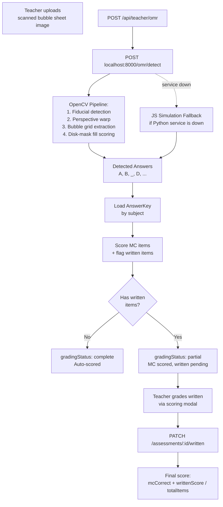
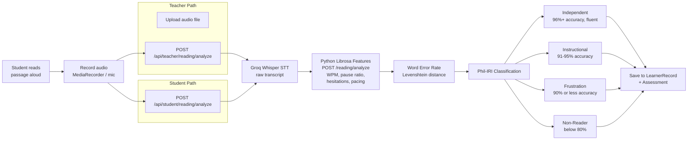
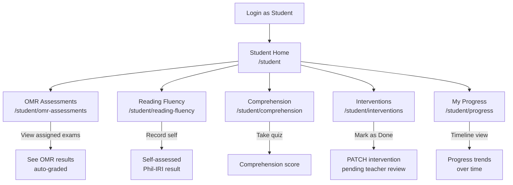
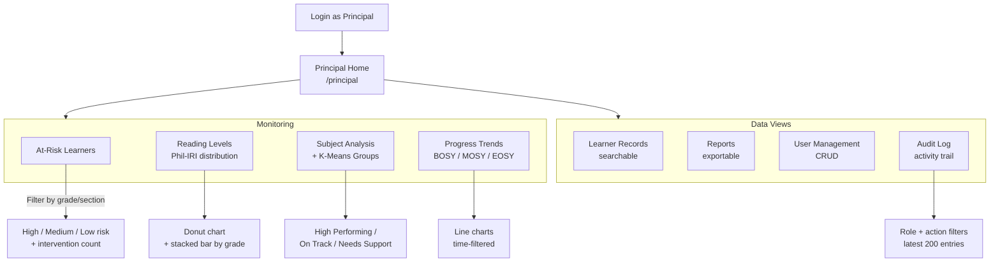
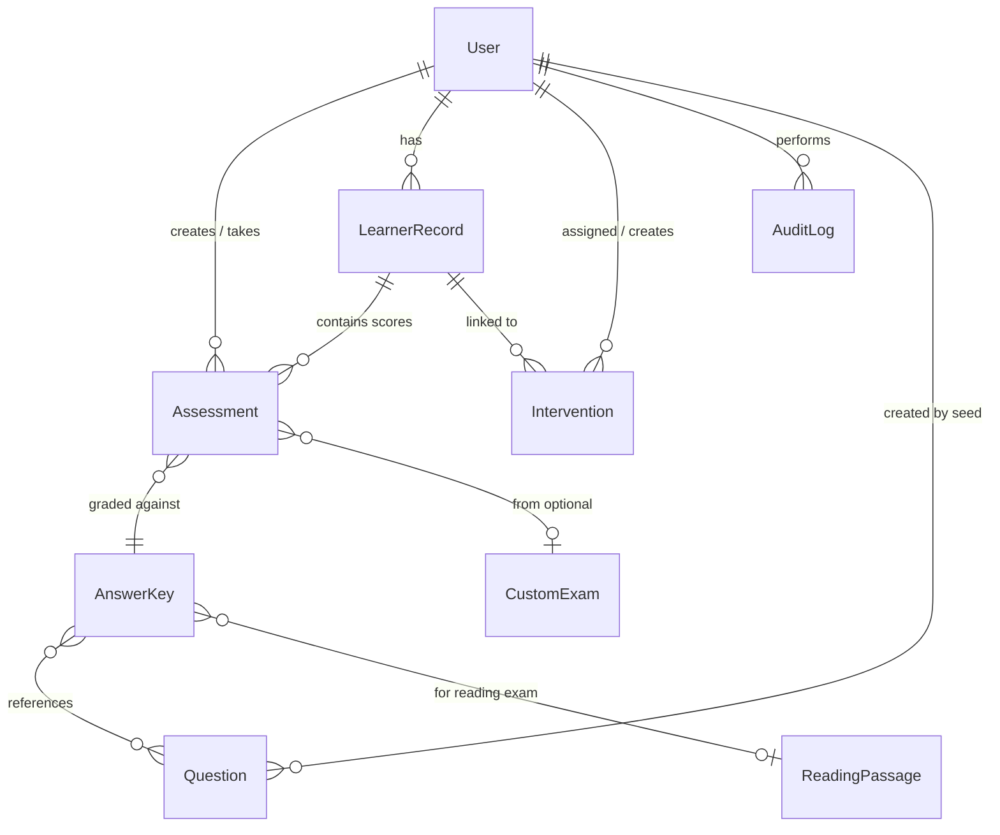
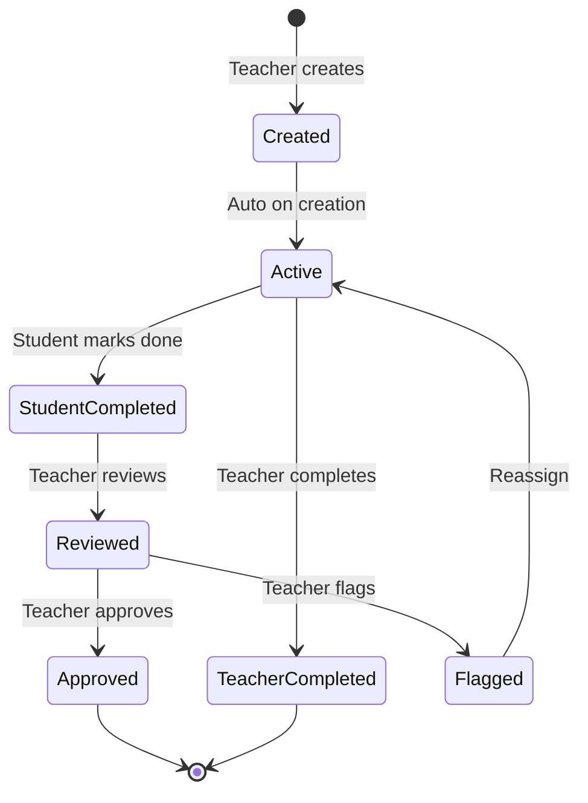
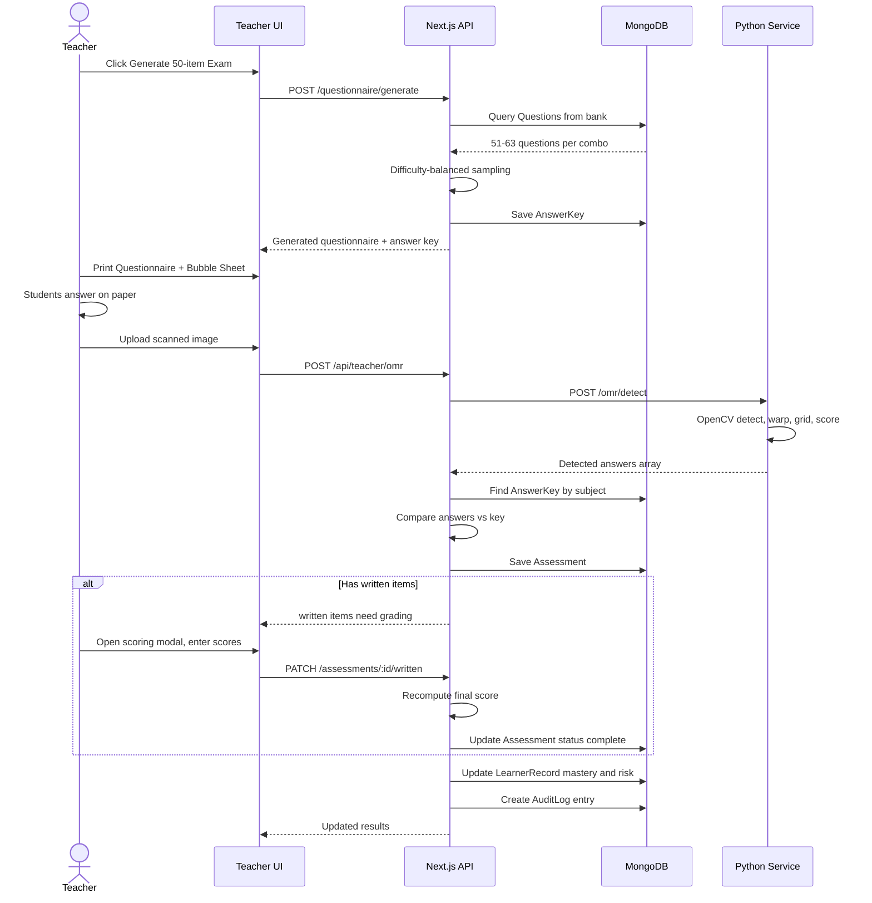

# AralSync — System Flow Diagram

> Open this file in VS Code and press **Ctrl+Shift+V** to see rendered diagrams.
> If diagrams appear blank, ensure the **Markdown Preview Mermaid Support** extension is installed.

---

## 1. High-Level Architecture

```mermaid
flowchart TB
    subgraph Client["Client - Next.js React"]
        Login["/login"]
        T_Dash["Teacher Dashboard\n/dashboard/*"]
        S_Dash["Student Portal\n/student/*"]
        P_Dash["Principal Dashboard\n/principal/*"]
    end

    subgraph Auth["Auth Layer"]
        JWT["JWT in HttpOnly Cookie"]
        AuthAPI["POST /api/auth/login\nGET /api/auth/me\nPOST /api/auth/logout"]
    end

    subgraph API["Next.js API Routes - Node.js"]
        T_API["Teacher APIs\nassessments, learners,\nOMR, reading, interventions"]
        S_API["Student APIs\nassessments, interventions,\nreading"]
        P_API["Principal APIs\ndashboard, reports,\nanalytics, audit-log"]
    end

    subgraph AI["Python AI Microservice :8000"]
        OMR_CV["OpenCV OMR Scanner\nPOST /omr/detect"]
        Reading_Feat["Librosa Reading Features\nPOST /reading/analyze"]
        KMeans["K-Means Clustering\nPOST /cluster/analyze"]
    end

    subgraph External["External APIs"]
        Groq["Groq Whisper API\nSpeech-to-Text"]
    end

    subgraph DB[("MongoDB")]
        Users["Users"]
        Assessments["Assessments"]
        LearnerRec["LearnerRecords"]
        Questions["Questions Bank"]
        AnswerKeys["AnswerKeys"]
        Interventions["Interventions"]
        ReadingPass["ReadingPassages"]
        CustomExams["CustomExams"]
        AuditLog["AuditLogs"]
    end

    Login --> AuthAPI --> JWT
    JWT --> T_Dash
    JWT --> S_Dash
    JWT --> P_Dash
    T_Dash --> T_API
    S_Dash --> S_API
    P_Dash --> P_API
    T_API --> DB
    S_API --> DB
    P_API --> DB
    T_API --> OMR_CV
    T_API --> Reading_Feat
    T_API --> KMeans
    S_API --> Reading_Feat
    T_API --> Groq
    S_API --> Groq
```

---

## 2. Authentication Flow

```mermaid
sequenceDiagram
    actor User
    participant Page as Login Page
    participant API as /api/auth/login
    participant DB as MongoDB
    participant Cookie as HttpOnly Cookie

    User->>Page: Enter username + password
    Page->>API: POST { username, password }
    API->>DB: Find User by username
    DB-->>API: User document
    API->>API: bcrypt.compare(password, hash)
    alt Match
        API->>API: Sign JWT { id, role, name }
        API->>Cookie: Set-Cookie: token=jwt; HttpOnly
        API-->>Page: { user: { id, name, role } }
        Page->>Page: Redirect based on role
    else No match
        API-->>Page: 401 Invalid credentials
    end

    Note over Page,Cookie: All subsequent requests carry JWT cookie
    Page->>API: GET /api/auth/me (with cookie)
    API->>API: Verify JWT and return user profile
```

**Role-based routing:**

| Role | Redirect |
|------|----------|
| `teacher` | `/dashboard` |
| `student` | `/student` |
| `principal` | `/principal` |

---

## 3. Teacher Workflow



---

## 4. OMR Scanning Pipeline



---

## 5. Reading Fluency Pipeline (Phil-IRI)



---

## 6. Student Portal Flow



---

## 7. Principal Dashboard Flow



---

## 8. Data Model Relationships



---

## 9. Intervention Lifecycle



---

## 10. Complete Request Flow (Typical OMR Exam)


